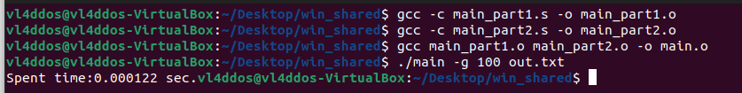
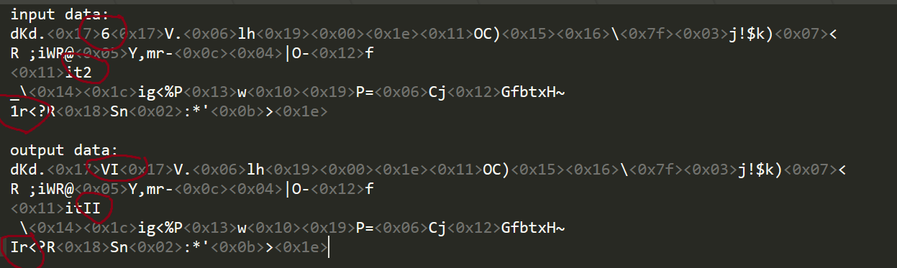
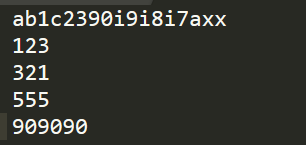
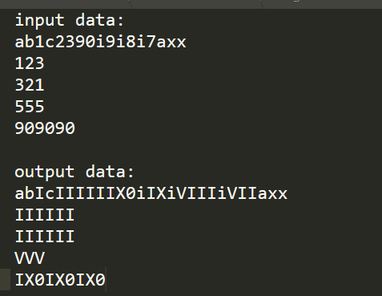
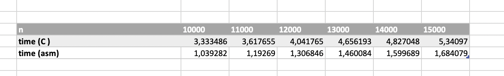
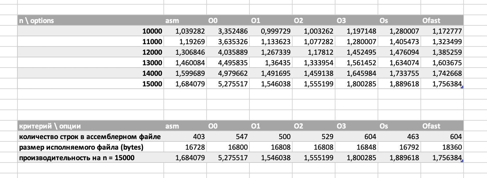

# Индивидуальное домашнее задание по АВС #2
## Сизикин Владислав Олегович (БПИ218), Вариант 8

## Задача:
    Разработать программу, заменяющую все цифры (за исключением нуля) в заданной ASCII-строке римскими цифрами. То есть, соответствующими комбинациями букв для цифр от 1 до 9.

## Формат входных данных: 
В файл вводится текст, в котором необходимо заменить цифры на римские

    1. |text| <= 10000 (длина текста <= 10000)
    2. ASCII-код каждого символа принадлежит отрезку [0; 127]

Пример:

    a1b2c09xz

Вывод: 

    input data:
    a1b2c09xz

    output data:
    aIbIIc0IXxz

# 4 балла
В файле [main.c](code/main.c) находится решение задачи на C (пункт 1).

Сперва была выполнена компиляция без оптимизирующих и отладочных функций, добавлены комментарии, поясняющие эквивалентное представление переменных в программе на C и в ассемблерном коде (пункт 2).

Ассемблерные файлы: [без оптимизаций](code/main_not_optimized.s), [с оптимизациями](code/optimized_commented.s).

команда без оптимизаций:

    gcc -O0 -Wall -masm=intel -S -fno-asynchronous-unwind-tables main.c -o main_not_optimized.s

Получили следующий [код](code/main_not_optimized.s)

Далее была произведена сборка с использованием следующей команды:

    gcc -O2 -Wall -masm=intel -fno-asynchronous-unwind-tables -fcf-protection=none -S qv_sort.c -o qv_sort.s

Таким образом, мы получили ассемблерный [код](code/optimized_commented.s) без лишних макросов (пункт 3).

Произвел сборку оптимизированной программы (пункт 4), далее начал ее тестировать

Приложил тестовое покрытие, проверяющее корректную и одинаковую работу программ на C и ассемблере (пункт 5).

!Важное примечание - в пункте 5 я буду модифицировать ассемблерный код, который я получил БЕЗ оптимизаций (для понятности)

# 5 баллов
Программа разбита на функции [main.c](code/main.c) (пункт 1)

[Ассемблерный код](code/main_not_optimized.s)

Локальные переменные были использованы (пункт 2).

Произвел сборку, добавил комментарии, описывающие передачу фактических параметров и перенос возвращаемого результата в ассемблерный код (пункт 3).

В функции добавил комментарии для формальных параметров, описывающие связь между регистрами и стэком и параметрами языка C (пункт 4).

# 6 баллов
Произвел оптимизацию программы ассемблера за счет использования регистров процессора (скомпилировали с -O2). Теперь программа использует регистры r12-r15 (пункт 1).

Получил следующий [ассемблерный код](code/optimized_commented.s)

Добавил комментарии, поясняющие альтернативное использование регистров вместо переменных исходной программы на С (пункт 2).

Произвел тестирование, приложил результаты. Программа работает корректно, судя по итогам тестов (пункт 3).

# 7 баллов
Разбил ассемблерный файл на две единицы компиляции (пункт 1).

[Первая](code/main_part1.s), [вторая](code/main_part2.s)

Произвел успешную сборку программы:

Уже присутствует возможность задания файлов ввода/вывода с использованием аргументов командной строки (пункт 2).

Код на [Си](code/main.c), [ассемблер](code/optimized_commented.s)

Произвел тестирование, приложил результаты. Вывод: программа работает корректно (пункт 3).

# 8 баллов
Разработал генератор случайных тестовых наборов данных (пункт 1).

Программа уже использует параметры коммандной строки для задания формата входных данных (из файла или генератором) (пункт 2).

Добавил функцию замера времени исполнения, после завершения программы выводится количество времени (в консоль), которое программа обрабатывала данные.

Чтобы время исполнения программы было больше 1 секунды я решил повторять обработку данных 50000 раз. Изменения в .

Привожу таблицу сравнения времени работы программы на ассемблеры и программ на Си с различными опциями сборки (пункт 3)

# 9 баллов
Произвел сравнение программ ассемблера (своей, а также программ, которые получается из исходной программы на Си с различными опциями компиляции).

Прикрепляю таблицу, где указано сравнение программ по времени (пункт 1) и по размеру файлов (пункт 2)

